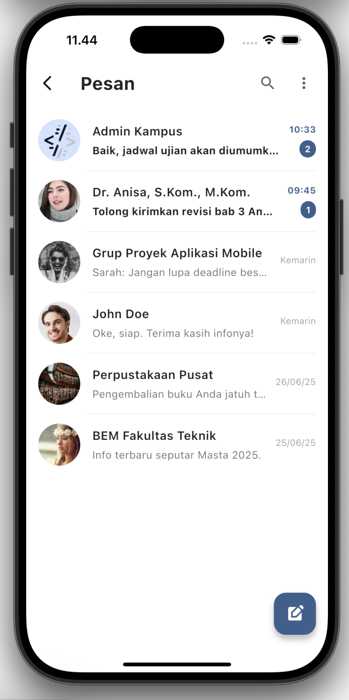
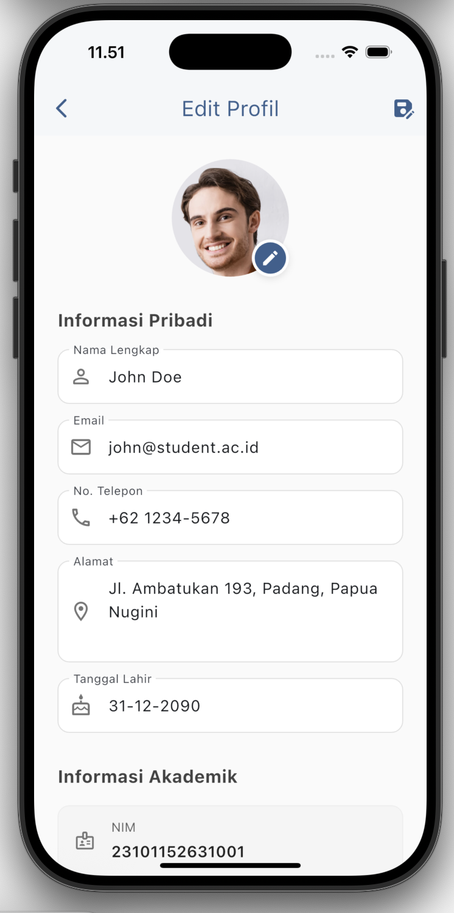
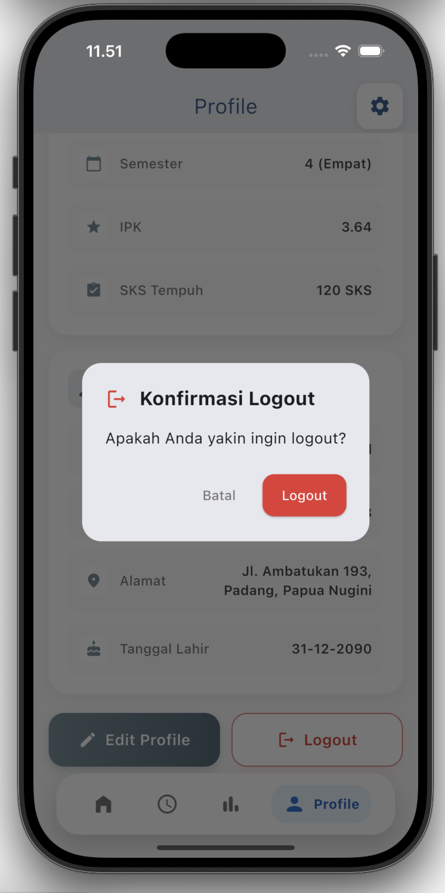

# 🎓 Akademik Group Task

<div align="center">
  
  
  
  
</div>

<div align="center">
  <h3>📱 Aplikasi Flutter Modern untuk Tugas Kelompok Akademik</h3>
  <p>Solusi digital yang memudahkan komunikasi, edukasi dalam satu aplikasi</p>
</div>

---

## ✨ Features

🔥 **Modern UI/UX** - Interface yang clean dan user-friendly  
👥 **Sosicial Post** - Postingan yang dapat dibagikan dengan teman dan dapat dilihat oleh semua  
📝 **KRS** - Susunan Jadwal Kuliah yang dapat diakses dengan mudah beserta nilai yang telah diperoleh  
🔔 **Notifications** - Notifikasi untuk deadline dan update

## 🏗️ Struktur Folder

```
akademik_group_task/
├── 📁 lib/
│   ├── 📁 pages/                 # Page components
│   |    ├── 📄 chat_page.dart    # Chat page
│   |    ├── 📄 edit_page.dart    # Edit Profile page
│   |    ├── 📄 jadwal_page.dart  # Jadwal page
│   |    ├── 📄 nilai_page.dart   # Nilai page
│   |    └── 📄 profil_page.dart  # Profil page
│   └── 📄 main.dart              # Entry point
├── 📁 assets/
│   ├── 📁 images/              # Gambar dan icon
│   ├── 📁 screenshoot/         # Custom fonts
├── 📁 test/                    # Unit & widget tests
└── 📄 pubspec.yaml             # Dependencies
```

## 🚀 Quick Start

### Prerequisites

- Flutter SDK (3.0+)
- Dart SDK (2.17+)
- IDE (VS Code/Android Studio/XCode)

### Installation

1. **Clone repository**

   ```bash
   git clone https://github.com/mikumimiestu/akademik_group_task.git
   cd akademik_group_task
   ```

2. **Install dependencies**

   ```bash
   flutter pub get
   ```

3. **Run aplikasi**
   ```bash
   flutter run
   ```

## 🛠️ Tech Stack

<div align="center">
  
  
</div>

## 📱 Screenshots

<div align="center">
  
  
  
  
  
  
  
</div>

## 🎯 Roadmap

- ✅ Basic UI Implementation
- ✅ Task CRUD Operations
- 🔄 Real-time Notifications
- 📋 Group Chat Feature
- 🔐 Authentication System
- ☁️ Cloud Sync
- 📊 Analytics Dashboard

## 🤝 Contributing

Kontribusi sangat diterima! Silakan:

1. Fork repository ini
2. Buat feature branch (`git checkout -b feature/AmazingFeature`)
3. Commit perubahan (`git commit -m 'Add some AmazingFeature'`)
4. Push ke branch (`git push origin feature/AmazingFeature`)
5. Buka Pull Request

## 📄 License

Distributed under the MIT License. See `LICENSE` for more information.

## 👨‍💻 Developer

<div align="center">
  
  
  
  <br/>
  
  
  
  
</div>

---

<div align="center">
  <p>⭐ Jangan lupa star repository ini jika bermanfaat!</p>
  
</div>
